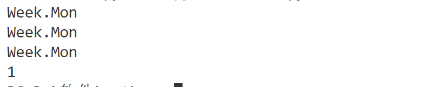

# 	PYTHON

## python简介

- python定位

  - 立志于简单优雅,提供非常完善的基础代码库,覆盖了文件,网络,GUI，数据库等
- python适合应用

  - 首选:网络应用，包括网站、后台服务  
- 许多日常需要的小工具，包括系统管理员需要的脚本任务等等
  - 把其他语言开发的程序再包装起来，方便使用
- python缺点：
  - 运行速度慢
  - 代码不能加密

## 安装Python

- 首先，根据Windows版本（64位还是32位）从Python的官方网站下载Python 3.8对应的[64位安装程序](https://www.python.org/ftp/python/3.8.0/python-3.8.0-amd64.exe)或[32位安装程序](https://www.python.org/ftp/python/3.8.0/python-3.8.0.exe)，然后，运行下载的exe安装包：

  - 特别要注意勾上`Add Python 3.8 to PATH`，然后点“Install Now”即可完成安装。

- 在cmd上打python

  - 安装成功

  - 若弹出store的窗口，需要去环境变量，把用户和系统环境变量的C:\Users\14264\AppData\Local\Microsoft\WindowsApps重启cmd即可。

### Python解释器

- 当编写Python代码时，我们得到的是一个包含Python代码的以`.py`为扩展名的文本文件。要运行代码，就需要Python解释器去执行`.py`文件。
- CPython：当我们从[Python官方网站](https://www.python.org/)下载并安装好Python 3.x后，我们就直接获得了一个官方版本的解释器：CPython。这个解释器是用C语言开发的，所以叫CPython。在命令行下运行`python`就是启动CPython解释器。
- IPython：在CPython的基础上进行包装，使其交互性更强
- PyPy：追求执行速度，采用Tim技术，对代码进行动态编译
- Jython：把Python代码编译成java字节码执行
- IronPython:在微软.net平台上的解释器，把Python编译成.Net的字节码。
- 小结：Python的解释器很多，但使用最广泛的还是CPython。如果要和Java或.Net平台交互，最好的办法不是用Jython或IronPython，而是通过网络调用来交互，确保各程序之间的独立性。

## 第一个Python程序

- 命令行模式和Python交互模式：
  - 用win+R打开运行输入cmd进入命令行模式，提示符类似`C:\>`，在命令行模式输入python进入Python交互模式，提示符是`>>>`
  - 在提示符`>>>`下，输入100+200，可以输出300，而在命令行模式上运行.by文件，不会输出，需要使用print()输出。
  - Python打印指定文字使用print()函数，文本单双引号都可以
  - 总结：Python交互模式的代码是输入一行，执行一行，而命令行模式下直接运行`.py`文件是一次性执行该文件内的所有代码。可见，Python交互模式主要是为了调试Python代码用的，也便于初学者学习，它*不是*正式运行Python代码的环境！

### 使用文本编辑器

使用微软出品的[Visual Studio Code](https://code.visualstudio.com/)，且不要使用window自带的记事本，Word保存的不是纯文本文件，而记事本会自作聪明地在文件开始的地方加上几个特殊字符（UTF-8 BOM），结果会导致程序运行出现莫名其妙的错误。


小结：直接输入`python`进入交互模式，相当于启动了Python解释器，但是等待你一行一行地输入源代码，每输入一行就执行一行。

直接运行`.py`文件相当于启动了Python解释器，然后一次性把`.py`文件的源代码给执行了，你是没有机会以交互的方式输入源代码的。

用Python开发程序，完全可以一边在文本编辑器里写代码，一边开一个交互式命令窗口，在写代码的过程中，把部分代码粘到命令行去验证，事半功倍！前提是得有个27'的超大显示器！

### 输入输出

- 输出：使用print()，可接受多个空格字符串，用逗号“,”隔开，就可以连成一串输出：

  ```python
  >>> print('The quick brown fox', 'jumps over', 'the lazy dog')
  The quick brown fox jumps over the lazy dog
  ```

  `print()`会依次打印每个字符串，遇到逗号“,”会输出一个空格，因此，输出的字符串是这样拼起来的

  对于100+200这种数学计算式，会输出结果，因此：

  ```python
  >>> print('100+300 =',100+300)
  100+300 = 400
  ```

- 输入：使用input('显示在控制台上面的提示')，输入字符串存到变量里面

  ```python
  name = input('请输入你的名字',':');
  print(name);
  ```

## Python基础

```python
#注释
```

### 数据类型和变量

- 数据类型

  - 浮点数： 1.3e-1=0.13
  - 字符串：使用单双引号括起，转义字符`\`，使用`r''`默认其中字符不转义。由于`\n`不好阅读，使用'''...'''格式表示多行内容
  - 布尔值：True和false，注意大小写
  - 空值：None
  - 常量：用全部大写变量表示，习惯无任何机制
  - `/`:结果为浮点数   `//`：结果只取整数部分

- 变量名:英文、数字、_的组合，且开头不能为数字。Python的变量类型不固定，称为动态语言

  - 变量的赋值过程：

    ```python
    a='abc';
    #1、在内存中创建了一个‘abc’的字符串和一个名为a的变量
    #2、把变量a指向字符串
    #3、而把一个变量a赋值为另一个变量b，实际上是把变量b指向变量a所指向的数据
    b=a;
    a='fff';
    print(b);
    >>>abc
    ```

- 小结：可以认为数据就是对象，变量用于指向对象的。对变量赋值`x = y`是把变量`x`指向真正的对象，该对象是变量`y`所指向的。随后对变量`y`的赋值*不影响*变量`x`的指向。整数、浮点数没用大小限制。

### 字符编码

- ASCII：只有127个字符，A为65，a为97。
- Unicode编码：Unicode把所有语言都统一到一套编码里，这样就不会再有乱码问题了。如果把ASCII编码的`A`用Unicode编码，只需要在前面补0就可以，因此，`A`的Unicode编码是`00000000 01000001`。
- UTF-8编码：在Unicode基础上形成可变长编码，减少内存浪费
  - 用记事本编辑的时候，从文件读取的UTF-8字符被转换为Unicode字符到内存里，编辑完成后，保存的时候再把Unicode转换为UTF-8保存到文件：
  - 浏览网页的时候，服务器会把动态生成的Unicode内容转换为UTF-8再传输到浏览器：

- Python编码：字符串是以Unicode编码，函数ord()获取字符的整数表示，char()把编码转化成字符串。

  - python字符串str以Unicode进行编码，如果要在网络上传输，或者保存到磁盘上，就需要把`str`变为以字节为单位的`bytes`。Python对`bytes`类型的数据用带`b`前缀的单引号或双引号表示：x = b'ABC'。

  - 以Unicode表示的`str`通过`encode()`方法可以编码为指定的`bytes`，例如：

    ```python
    >>> 'ABC'.encode('ascii')
    b'ABC'
    >>> '中文'.encode('utf-8')
    b'\xe4\xb8\xad\xe6\x96\x87'
    >>> '中文'.encode('ascii')
    Traceback (most recent call last):
      File "<stdin>", line 1, in <module>
    UnicodeEncodeError: 'ascii' codec can't encode characters in position 0-1: ordinal not in range(128)
    ```

  - 如果我们从网络或磁盘上读取了字节流，那么读到的数据就是`bytes`。要把`bytes`变为`str`，就需要用`decode()`方法：

    ```python
    >>> b'ABC'.decode('ascii')
    'ABC'
    >>> b'\xe4\xb8\xad\xe6\x96\x87'.decode('utf-8')
    '中文'
    ```
    
  - 格式化：格式：'字符串%s' % 替换变量

    ```python
     >>> 'Hello, %s' % 'world'
    'Hello, world'
    >>> 'Hi, %s, you have $%d.' % ('Michael', 1000000)
    'Hi, Michael, you have $1000000.'
    ```


​		其中，格式化整数和浮点数还可以指定是否补0和整数与小数的位数：

```python
print('%2d-%02d' % (3, 1))
print('%.2f' % 3.1415926)
>>>3-01
>>>3.14
```

- format():使用字符串的`format()`方法，它会用传入的参数依次替换字符串内的占位符`{0}`、`{1}`……，不过这种方式写起来比%要麻烦得多：

  ```python
  >>>'Hello,{0},成绩提高了{1：.001f}%'.format('小名',17.125
  >>>Hello,小名，成绩提高了17.125%            
  ```

- f-string:使用格式f'字符串'，若其中包含{变量名}，会进行变量替换

  ```python
  >>> r = 2.5
  >>> s = 3.14 * r ** 2
  >>> print(f'The area of a circle with radius {r} is {s:.2f}')
  The area of a circle with radius 2.5 is 19.62
  ```

### 使用list和tuple

#### list

- 定义：是Python里内置的一种数据类型列表，是一种有序集合，可以随时添加或删除其中元素。

- 语法：

  ```python
  classmates=['mike','john','marry'];#定义
  classmates;#输出
  >>>['mike','john','marry'];
  len(classmates);#获得list元素个数，没元素时为零
  classmates[-3~2];#通过下标读取元素，负数表示倒数几位
  classmates.append('adam');#在末尾追加新元素
  classmates;#输出
  >>>['mike','john','marry','adam'];
  classmates.insert(1,'jack');#在指定位置插入元素
  classmates;
  >>>['mike','jack','john','marry','adam'];
  classmates.pop();#删除最后一个元素
  classmates.pop(1);#删除指定位置元素
  L=[11,'ad',True];#list中元素可以不同
  S=['11',L]#list中元素可以为list
  S[1,1];#取list中的list元素类似于二维数组
  >>>11;
  ```

#### tuple

- tuple也是一种有序列表，但是一旦确认了就不可以更改

- 格式：t=(1,2);

- 优点：更加安全

- 陷阱：在定义的时候，元素就必须被确定下来

- 定义一个元素时的歧义：

  ```python
  t=(1);#此时括号也可以表示为数学中的小括号，顾定义tuple时必须1后面加个逗号消除歧义
  t=(1,);
  ```

- 可变的tuple：其中tuple的元素为list时，其中list中的元素 可变

  ```python
  t=(1,2,['a','b']);
  t[2,0]='c';
  t[2,1]='d';
  t;
  >>>(1,2,['c','d']);
  ```

#### if条件判断

- 格式：

  ```python
  age = 3;
  if age>=18:
  	print("adult");
  elif age>12:
  	print("teenager");
  else:
  	print("child");
  ```

- 再议input:input()返回的数据都为str，可以用int()把str转化成int；

#### 循环

- for-in循环：

  ```python
  classmates=['mike','john','marry'];
  for classmate in classmates:
      print(classmate);
  ```

  - range(n)函数：提供0到n之间的整数序列，再用list()转化成list；

- while循环：

  ```python
  sum=0;
  n=0;
  while n<100:
   sum=sum+n;
   n++;
  print sum;#缩进表示while语句什么时候结束
  ```

#### 使用dict和set

- dict：

  - 原理：Hash表原理，使用空间换时间，用key找到value的内存地址。

  - 语法：

    ```python
    d={'mike':12,'bob':22,'john':21};#定义
    d['mike'];#根据key取得value
    >>>12
    'bob'in d;#判断相关key是否已存在dict里面
    >>>True
    d.get('marrt',-1);#若不存在默认返回None，也可以自己设定值
    >>>-1
    ```

  - 说明：dict中的key不能是可变对象，因为dict根据key来计算value的存储位置，如果每次计算相同的key得出的结果不同，那dict内部就完全混乱了。这个通过key计算位置的算法称为哈希算法（Hash）

- set：

  - 功能：也是一组key的集合，但不存储value。由于key不能重复，所以，在set中，没有重复的key。

  - 语法：

    ```python
    s=set([1,2,3]);#定义
    s.add(1);#通过add(key)方法可以添加元素到set中，可以重复添加，但不会有效果
    s.remove(1);#通过remove(key)方法可以删除元素：
    b=set([2,4]);
    s&b;#set可以看成数学意义上的无序和无重复元素的集合,两个set可以做数学意义上的交集、并集等操作
    >>>{2}
    s|b
    >>>{1,2,3,4}
    ```

  - 注意：不可放入list等可变对象，因为无法判断两个可变对象是否相等

## 函数

### 定义函数

- 在Python中，定义一个函数要使用`def`语句，依次写出函数名、括号、括号中的参数和冒号`:`，然后，在缩进块中编写函数体，函数的返回值用`return`语句返回。

  ```python
  def my_abs(x):
  	if x>0:
  		return x;
  	elif x<=0:
  		return -x;
  ```

  - 说明：

    - 如果没用return，程序块运行完也会返回None；

    - 在Python交互环境中定义函数时，注意Python会出现`...`的提示。函数定义结束后需要按两次回车重新回到`>>>`提示符下；

      

    - 如果把`my_abs()`的函数定义保存为`abstest.py`文件了，可以在该文件的当前目录下启动Python解释器，用`from abstest import my_abs`来导入`my_abs()`函数，注意`abstest`是文件名（不含`.py`扩展名）：

- 空函数：

  - 定义一个函数，在里面什么也不做，用pass语句。pass语句什么也不做，实际上`pass`可以用来作为占位符，比如现在还没想好怎么写函数的代码，就可以先放一个`pass`，让代码能运行起来。缺少不行。

    ```python
    def nop():
        pass
    if age >= 18:
        pass
    ```

- 参数检查：

  - 目的：使得参数传入有错时有相应的提示；

  - 数据类型检查可以用内置函数`isinstance()`实现：

    ```python
    def my_abs(x):
    	if not isinstance(x,(int,float)):
    		raise TypeError('bad aperand type');
        if x>=0:
        	return x;
        elif x<0:
        	return -x;
    ```

- 返回多个值：

  - 函数可以返回多个值，实际上就是返回一个tuple

    ```python
    import  math;
    def move(x,y,step,angle=0):
        nx=x+step*math.cos(angle);
        ny=y-step*math.sin(angle);
        return nx,ny;
    
    x,y=move(12,12,12,math.pi/6);
    a=move(12,12,12,math.pi/6);
    
    print(x,y);
    print(a);
    ```

    

- 小结：
  - 定义函数时，需要确定函数名和参数个数；
  - 如果有必要，可以先对参数的数据类型做检查；
  - 函数体内部可以用`return`随时返回函数结果；
  - 函数执行完毕也没有`return`语句时，自动`return None`。
  - 函数可以同时返回多个值，但其实就是一个tuple。

### 函数参数

#### 默认参数

- 不按顺序提供部分默认参数。当不按顺序提供部分默认参数时，需要把参数名写上。比如调用`enroll('Adam', 'M', city='Tianjin')`，意思是，`city`参数用传进去的值，其他默认参数继续使用默认值。
- 默认参数的坑：当默认参数定义为list这种可变对象时，第一次改变对象的值，第二次使用这个方法时对象为第一次改变后的值。定义默认参数要牢记一点：默认参数必须指向不变对象！

```python
def my_abs(x=[]):
    x.append('end');
    return x;
print(my_abs());
print(my_abs());
```


#### 可变参数

```python
abs(*x):#方法定义时，加*表示把输入的多个参数自动组装成tuple
abs(*x);#方法使用时，加*表示把一个原本就是tuple或list的直接传输到方法里面
```

#### 关键字参数

在定义函数参数时，可以使用abs(**x)，把多个key=value包装成dict传入方法里面。

在使用函数时，可以加两个**把原本的dict传入方法内。是一种拷贝。

```python
def person(name,age,**kw):
	print('name:',name,'age:',age,'other:',kw);
person('man',18,city='beijing');
extra={'city':'beijing','begin':'jinan'}
person('man',18,**extra);
```


#### 命名关键字参数

命名关键字参数需要一个特殊分隔符`*`，`*`后面的参数被视为命名关键字参数。

```python
def person(name, age, *, city, job):
    print(name, age, city, job)
```

如果函数定义中已经有了一个可变参数，后面跟着的命名关键字参数就不再需要一个特殊分隔符`*`了：

```python
def person(name, age, *args, city, job):
    print(name, age, args, city, job)
```

关键字参数在传入的时候，必须携带参数名字（与位置参数的区别）。若不传入，则会报错。若关键字参数可以有默认值，若有默认值，则可以不传入。

#### 参数组合

在Python中定义函数，可以用必选参数、默认参数、可变参数、关键字参数和命名关键字参数，这5种参数都可以组合使用。但是请注意，参数定义的顺序必须是：

​				必选参数、默认参数、可变参数、命名关键字参数和关键字参数。

#### 小结

Python的函数具有非常灵活的参数形态，既可以实现简单的调用，又可以传入非常复杂的参数。

默认参数一定要用不可变对象，如果是可变对象，程序运行时会有逻辑错误！

要注意定义可变参数和关键字参数的语法：

`*args`是可变参数，args接收的是一个tuple；

`**kw`是关键字参数，kw接收的是一个dict。

以及调用函数时如何传入可变参数和关键字参数的语法：

可变参数既可以直接传入：`func(1, 2, 3)`，又可以先组装list或tuple，再通过`*args`传入：`func(*(1, 2, 3))`；

关键字参数既可以直接传入：`func(a=1, b=2)`，又可以先组装dict，再通过`**kw`传入：`func(**{'a': 1, 'b': 2})`。

使用`*args`和`**kw`是Python的习惯写法，当然也可以用其他参数名，但最好使用习惯用法。

命名的关键字参数是为了限制调用者可以传入的参数名，同时可以提供默认值。

定义命名的关键字参数在没有可变参数的情况下不要忘了写分隔符`*`，否则定义的将是位置参数。

### 递归函数


## 高级特性

在Python中，代码不是越多越好，而是越少越好。代码不是越复杂越好，而是越简单越好。

基于这一思想，我们来介绍Python中非常有用的高级特性，1行代码能实现的功能，决不写5行代码。请始终牢记，代码越少，开发效率越高。

### 切片

可以用在list、tuple、字符串上；

```python
L[0:2]#表示从序列0开始，不包括序列2；
L[0:4:2]#表示从序列0开始，不包括序列4,每两个取一个元素
L[:-1]#表示取到倒数第一的前一个元素
# 当i缺省时，默认为0，即 a[:3]相当于 a[0:3]
# 当j缺省时，默认为len(alist), 即a[1:]相当于a[1:10]
# 当i,j都缺省时，a[:]就相当于完整复制一份a
b = a[i:j:s]    # 表示：i,j与上面的一样，但s表示步进，缺省为1.
# 所以a[i:j:1]相当于a[i:j]
# 当s<0时，i缺省时，默认为-1. j缺省时，默认为-len(a)-1
# 所以a[::-1]相当于 a[-1:-len(a)-1:-1]，也就是从最后一个元素到第一个元素复制一遍，即倒序。
```

### 迭代

```python
for list in list:#对list、tuple的迭代
for key in dict：#获取dict的key值
for value in d.values()：#获取dict的values值
for k, v in d.items()：#获取dict的key、values值
for s in str(): #对str的迭代
isinstance('abc', Iterable) # str是否可迭代
for i, value in enumerate(['A', 'B', 'C']):#对下标和值的迭代
  print(i, value)
```

### 列表生成器

在for in 的基础上简化，原本对for in 里面的元素，需要在代码块内进行修改，而通过列表生成器，直接可以修改生成对应的list列表。

```python
L=[] #普通for in写法
for x in range(1,11):
    L.append(x*x)
[x*x for x in range(1,11)] #列表生成器写法
#可以使用if语句进行判断
	#if语句在for前面，需要if-else，是x的表达式
[x if x%2=0 else -x for x in range(1,11)]
	#if语句在for后面，只能用if，是过滤条件
[x for x in range(1,11)if isinstance(x,str)]
#可以使用两层循环，可以生成全排列：
[x+y for x in 'abc' for  y in 'ABC']
```

### 生成器

- 列表生成器弊端：受到内存的限制，且容易造成空间的浪费。

- generator生成器：列表元素可以按照某种算法推演出来。

- 定义：在列表生成器的基础上，把 中括号 改成 小括号 即可。

- 输出元素：

  - 使用next（generator）循环推演，但推演到最后的时候，容易造成`StopIteration`的错误
  - 使用 for g in generator 循环输出

- 定义generator函数：

  - 使用上yield关键字，函数是顺序执行，遇到`return`语句或者最后一行函数语句就返回。而变成generator的函数，在每次调用`next()`的时候执行，遇到`yield`语句返回，再次执行时从上次返回的`yield`语句处继续执行。

  - ```python
    def odd():
        print('step 1')
        yield 1
        print('step 2')
        yield(3)
        print('step 3')
        yield(5)
    ```

    

- 用`for`循环调用generator时，发现拿不到generator的`return`语句的返回值。如果想要拿到返回值，必须捕获`StopIteration`错误，返回值包含在`StopIteration`的`value`中：

- ```python
  >>> g = fib(1)
  >>> while True:
  ...     try:
  ...         x = next(g)
  ...         print('g:', x)
  ...     except StopIteration as e:
  ...         print('Generator return value:', e.value)
  ...         break
  ...
  Generator return value: done
  ```

  ### 迭代器

- 可迭代对象：

  - 可以直接作用于`for`循环的对象统称为可迭代对象（Iterable)

  - 判断：`isinstance()`判断一个对象是否是`Iterable`对象：

    ```python
    from collections.abc import Iterable
    print(isinstance([],Iterable))
    ```

- 迭代器：

  - 生成器不但可以作用于`for`循环，还可以被`next()`函数不断调用并返回下一个值，直到最后抛出`StopIteration`错误表示无法继续返回下一个值了。

    可以被`next()`函数调用并不断返回下一个值的对象称为迭代器：`Iterator`。

    可以使用`isinstance()`判断一个对象是否是`Iterator`对象；

- 区别：生成器都是`Iterator`对象，但`list`、`dict`、`str`虽然是`Iterable`，却不是`Iterator`。

  把`list`、`dict`、`str`等`Iterable`变成`Iterator`可以使用`iter()`函数：

  ```python
  >>> isinstance(iter([]), Iterator)
  True
  >>> isinstance(iter('abc'), Iterator)
  True
  ```

- 小结：

  - 凡是可作用于`for`循环的对象都是`Iterable`类型；

  - 凡是可作用于`next()`函数的对象都是`Iterator`类型，它们表示一个惰性计算的序列；

  - 集合数据类型如`list`、`dict`、`str`等是`Iterable`但不是`Iterator`，不过可以通过`iter()`函数获得一个`Iterator`对象。

## 函数式编程

函数式编程核心：允许把函数本身作为参数传入另一个函数，还允许返回一个函数！

### 高阶函数

```python
def f(x):
    if x>=0:
        return x
    else:
        return -x;
def sum_abs(a,b,f):
    return f(a)+f(b);
print(sum_abs(2,-1,f))    
```

#### map/reduce

- map

  - `map()`函数接收两个参数，一个是函数，一个是`Iterable`，`map`将传入的函数依次作用到序列的每个元素，并把结果作为新的`Iterator`返回。

    ```python
    def f(x):
        return x**2;
    print(list(map(f,range(10))));
    ```

  - 注意：返回的是一个序列，可用list()转化成list再输出；

- reduce

  - `reduce`把一个函数作用在一个序列`[x1, x2, x3, ...]`上，这个函数必须接收两个参数，`reduce`把结果继续和序列的下一个元素做累积计算，其效果就是：

    ```python
    reduce(f, [x1, x2, x3, x4]) = f(f(f(x1, x2), x3), x4)
    ```

  - 示例用处把str转化成int：

    ```python
    from functools import reduce
    def my_change(s):
        dict={'0':0,'1':1,'2':2,'3':3,'4':4,'5':5,'6':6,'7':7,'8':8,'9':9}
        return dict[s]
    def f(x,y):
        return x*10+y
    def my_int(str):
        return reduce(f,map(my_change,str));
    print(my_int('12421'));
    ```

#### filter

`filter()`也接收一个函数和一个序列,把传入的函数依次作用于每个元素，然后根据返回值是`True`还是`False`决定保留还是丢弃该元素。

```python
def _odd_iter():
    n = 1
    while True:
        n = n + 2
        yield n
def _not_divisible(n):#返回一个lambda函数，此函数有一个x参数，返回值为Boolean
    return lambda x: x % n > 0
def primes():
    yield 2
    it = _odd_iter() # 初始序列
    while True:
        n = next(it) # 返回序列的第一个数
        yield n
        it = filter(_not_divisible(n), it) # 构造新序列
# 打印1000以内的素数:
for n in primes():
    if n < 1000:
        print(n)
    else:
        break
```

#### sorted

格式：sorted(序列,key函数)

说明：key函数的参数是序列的每一个一维元素的集合

```python
>>> sorted([36, 5, -12, 9, -21], key=abs)
[5, 9, -12, -21, 36]
```

要进行反向排序，不必改动key函数，可以传入第三个参数`reverse=True`：

```python
>>> sorted(['bob', 'about', 'Zoo', 'Credit'], key=str.lower, reverse=True)
['Zoo', 'Credit', 'bob', 'about']
```

### 返回函数

- 重点：当return一个函数时，函数并没用立即执行，而是把相关参数和变量都保存在返回的函数中，形成一个闭包，返回的是一个函数名。

```python
def lazy_sum(*args):#*args代表可变参数
    def sum():
        ax=0
        for n in args:
            ax=ax+n
        return ax
    return sum

s=lazy_sum(1,2,3,4,5)#相当于定义了个sum函数命名为s了
print(s())   
```


- 注意：返回函数其中不要引用任何循环变量，或者后续会发生变化的变量。因为函数并没用立即执行，会更改原本的值。

```python
def count():
    fs=[]
    for i in range(1,4):
        def f():
            return i*i
        fs.append(f)
    return fs;
f1,f2,f3=count();
print(f1())
print(f2())
print(f3())
```


- 如果一定要引用循环变量怎么办？方法是再创建一个函数，用该函数的参数绑定循环变量当前的值，无论该循环变量后续如何更改，已绑定到函数参数的值不变。

```python
def count():
    fs=[]
    def ff(i):
        def f():
            return i*i
        return f;
    for i in range(1,4):
        fs.append(ff(i));
    return fs;
f1,f2,f3=count();
print(f1())
print(f2())
print(f3())
```


### 匿名函数

- 格式：

  ```python
  lambda x: x * x
  #相当于：
  def f(x):
      return x * x
  ```

- 限制：匿名函数有个限制，就是只能有一个表达式，不用写`return`，返回值就是该表达式的结果。

- 因为函数没有名字，不必担心函数名冲突。也可以把匿名函数作为返回值返回。

### 装饰器

- 前提：对于一个函数，其实也就是一个对象，有着其特定的函数。

- 功能：在调用特定函数的时候，可以使用装饰器增加功能

- 定义：本质上，decorator就是一个返回函数的高阶函数

  ```python
  #装饰器不需要传入参数的格式：
  def log(fuc):
      @functools.wraps(fuc)#需要把原始函数的__name__等属性复制到wrapper()函数中，否则，有些依赖函数签名的代码执行就会出错
      #import functools是导入functools模块。模块的概念稍候讲解。现在，只需记住在定义wrapper()的前面加上@functools.wraps(func)即可。
      def wrapper(*args,**kw):
          print('call : %s()' % func.__name__)
          return fuc(*args,**kw)
      return wrapper
  #装饰器需要传入参数的格式：
  #如果decorator本身需要传入参数，那就需要编写一个返回decorator的高阶函数
  def log(text):
      def decorator(fuc):
          @functool.wraps(fuc)
          def wrapper(*args,**kw):	
              print('%s : %s()' % (text,func.__name__)) 
              return fuc(*args,**kw)
          return wrapper
      return  decorator
  #调用装饰器：
  
  @log
  def f(x):
      return x
  ```

### 偏函数

- Python的`functools`模块提供了很多有用的功能，其中一个就是偏函数（Partial function）。

- 功能：当函数的参数个数太多，需要简化时，使用`functools.partial`可以创建一个新的函数，这个新函数可以固定住原函数的部分参数，从而在调用时更简单。

- 举例：

  ```python
  #在int('1234',base=10)中，可以把base默认值改为2，创建新的函数：
  import functools
  int2=functools.partial(int,base=2);
  ```

- 注意，在创建偏函数的时候，可以接收函数对象、`*args`和`**kw`这3个参数，上例中若base=2去掉指向，会把2作为`*args`的一部分自动加到左边

  ```python
  max2 = functools.partial(max, 10)
  max2(5, 6, 7)
  #相当于
  args = (10, 5, 6, 7)
  max(*args)
  ```

  

## 模块

- 定义：称一个.py文件为一个 模块
- 好处：
  - 提高了代码的可维护性
  - 一个模块可引用其它模块，写代码可在前面代码的基础上编写
  - 使用模块还可以避免函数名和变量名冲突。
- 引入包的概念，避免模块的重名

### 模块的使用

- 导入其它模块：

  ```python
  import math
  ```

- 编写模块：

  ```python
  #!/usr/bin/env python3		可以让这个hello.py文件直接在Unix/Linux/Mac上运行
  # -*- coding: utf-8 -*-    	表示.py文件本身使用标准UTF-8编码；
  
  ' a test module '     #表示模块的文档注释，任何模块代码的第一个字符串都被视为模块的文档注释；
  
  __author__ = 'Michael Liao'  #使用__author__变量把作者写进去
  
  import sys  #导入其它模块 
  ```

- 模块搜索路径：

  - 当我们试图加载一个模块时，Python会在指定的路径下搜索对应的.py文件，如果找不到，就会报错
  - 默认情况下，Python解释器会搜索当前目录、所有已安装的内置模块和第三方模块，搜索路径存放在`sys`模块的`path`变量中
  - 添加自己的搜索目录
    - 一是直接修改`sys.path`，添加要搜索的目录；
    - 第二种方法是设置环境变量`PYTHONPATH`

- 变量作用域：

  - 类似`__xxx__`这样的变量是特殊变量，可以被直接引用，但是有特殊用途
  - 类似`_xxx`和`__xxx`这样的函数或变量就是非公开的（private），不应该被直接引用
  - 正常的函数和变量名是公开的（public），可以被直接引用

## 面向对象基础编程

### 类和实例

- 类的定义：

  ​	通过`class`关键字

  ```python
  class Student(object): #括号里面是继承的类
      pass
  ```

- 创建实例：

  ```python
  bart = Student()
  ```

- 绑定属性：

  ```python
  bart.name='yingshang'
  bart.name
  >>>'yingshang'
  ```

- 强制定义属性：使用__init__函数，在创建实例的时候，就必须把属性绑定上去

  ```python
  class Teacher(object):
  	def __init__(self,name,subject):
  		self.name=name
  		self.subject=subject
  mary=Teacher('Mary','math')
  ```

- 动态语言的不同：Python允许对实例变量绑定任何数据，也就是说，对于两个实例变量，虽然它们都是同一个类的不同实例，但拥有的变量名称都可能不同

### 访问限制

在定义的属性名前加上两个下划线__,属性就变成了一个私有属性。前后都有下划线的，表示有特殊的涵义，但是不是私有属性。

### 获取对象信息

- 目的：根据一个实例引用，推断出类型和具有哪些方法

- 推断类型：

  - 使用 __type（）__函数，返回的是一个Class类型，判断为函数之类的可用其中定义的函数

  - 使用__isinstance（）__函数，优点是可用将指定类型及其子类都判断

    ```python
    isinstance(dag,animal)
    >>>True
    ```

- 获取方法：

  - 使用__dir（）__函数，获取所有属性和方法的list字符串

  -  仅仅把属性和方法列出来是不够的，配合`getattr()`、`setattr()`以及`hasattr()`，我们可以直接操作一个对象的状态：
    - getattr（）：获取对应属性值
    - setattr（）：设置对应属性
    - hasattr（）：判断是否有对应属性

## 面向对象高级编程

数据封装、继承、多态只是基本的概念，这章见解多重继承、元类、定制类等高级特性

### 方法绑定和__slots__方法

- 方法绑定：

  - 面向对象方法定义：

    ```python
    def set_age(self,age):
    	self.age=age
    ```

  - 绑定方法：

    - 使用MethodType绑定：

    ```python
    class Student(object):
    	pass
    s=Student()
    from types import MethodType
    s.set_age=MethodType(set_age,s) #给实例对象s绑定set_age方法，类不可用
    Student.set_age=MethodType(set_age,Student) #给类Student绑定set_age方法，类和实例都可用
    s.set_age(12)
    Student.set_age(13)
    print('Method.set_age:',s.age)
    print('Student.set_age:',Student.age)
    ```

    - 使用等号直接赋值：
      - 只可给类直接赋值，且方法只有实例对象可用

- __slots__属性：

  - 功能：限制对象所能绑定的属性

  - 语法：

    ```python
    class Student(object):
    	__slots__=('name','socre')
    ```

  - 说明：继承子类不可限制，除非子类也定义__slots__属性，如此子类的限制就是父类限制加子类限制

### @property的使用

- 功能：使得可用检查属性的同时，又可用类似属性这样简单的方式来访问类的变量

- 语法：

  ```python
  class Student(object):
      @property
      def score(self): #把score方法变成了一个属性
          return self._score
      
      @score.setter   #定义为score的setter函数
      def score(self,value): 
          if not isinstance(value, int):
              raise ValueError('score must be an integer!')
          if value < 0 or value > 100:
              raise ValueError('score must between 0 ~ 100!')
          self._score = value
  s=Student()
  s.score=10000
  #类里面定义的是_score，可在外部可以直接调用socre
  ```

- 特殊情况：

  - 所不定义__@score.setter__，则默认为只读属性。

### 多重继承

- 格式：

  ```python
  class Dog(Mammal,Runnable):
  	pass
  ```

- Mixln思想设计：
  
  - 多重继承看做给对象类增加多种功能，而主线通常是单一继承下来的。

### 定制类

- 含义：通过一系列有特殊含义的函数，使得类有获得着特殊功能。

#### __str__

- 功能：使得打印类的实例时，不但好看，更容易看出实例内部的结构

```python
class Student(object):
	def __init__(self,name):
		self.name=name
    def __str__(self):
    	return 'Student object(name :%s)' % self.name
print(Student("marry"))
>>>Student object(name :marry)
```

- 局限：只能打印实例，但直接敲变量不用print时，打印变量无法打出相关信息。必须使用__repr__方法。

#### __iter__

功能：使得实例对象成为一个可以迭代的对象

```python
class Fib(object):
    def __init__(self):
        self.a,self.b=0,1
    def __iter__(self): #确认迭代对象为对象本身
        return self
    def __next__(self):
        self.a,self.b=self. b,self.a+self.b
        if self.a>100:
            raise StopIteration()
        return self.a
fib=Fib()
for f  in fib: #iter使得对象可以使用for_in循环输出_next_返回的值
    print(f)
```

#### __getitem__

功能：使得对象像list一样可以通过下标读出迭代对应的值

```python
class Fib(object):
    def __getitem__(self,n):
        a,b=1,1
        for x in range(n):
            a,b=b,a+b
        return a
fib=Fib()
print(fib[1])
print(fib[22])
```

局限：只能通过下标，切片之类的无法处理。

解决：通过isinstance判断n输入是int下标类型还是slice切片类型													

#### __getattr__

功能：使得对象调用不存在的属性的时候，返回定义的return值

```python
class Student(object):
    def __init__(self):
        self.name="marry"
    def __getattr__(self,attr):
        if attr=='num': #返回属性值
            return 99
s=Student()
print(s.name)
print(s.num)
```

拓展：也可以返回特定的函数

```python
class Student(object):

    def __getattr__(self, attr):
        if attr=='age':
            return lambda: 25
s=Student()
print(s.age())
```

### 枚举类

 功能：使用枚举类去使用特定的常量

定义方法：

```python
from enum import Enum
week=Enum('Week',('Mon','Tue','Wed','Tud','Fir','Sat','Sun'))

print(week(1))
print(week.Mon)
print(week['Mon'])
print(week.Mon.value)

#========================================
from enum import Enum
class Sex(Enum): #使用类的方式去细致定义
    Man = 0
    Woman = 1

marry=Sex.Woman
print(marry.value)
```



